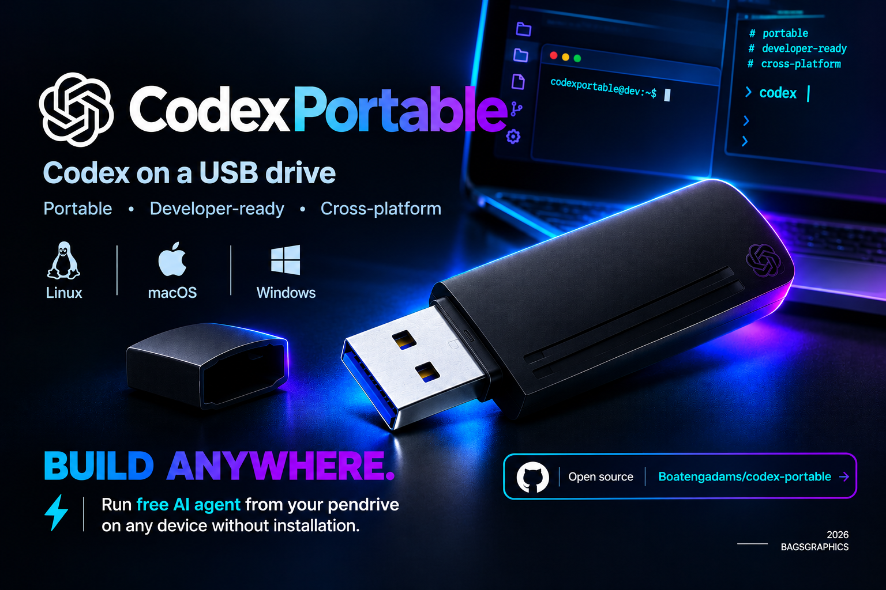
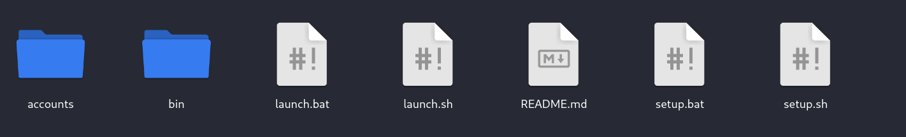

# CodexPortable



**Portable AI coding environment designed to run from removable storage across Linux, macOS, and 64-bit Windows.**

CodexPortable keeps the application runtime, platform binaries, and account profiles organized in a single portable directory, making it possible to carry a consistent coding environment between compatible machines.

## 🎬 See CodexPortable in action

A quick visual tour of the portable Codex workflow, account profiles, and cross-platform launchers.


[▶ Download the MP4 version](videos/vid.mp4)

> The animated preview plays automatically on GitHub. Use the MP4 link for the full-resolution video.

> **Project by BAGSGRAPHICS — 2026**

---

##  Features

- **USB-first portability** — keep the project on a removable drive and use it across compatible computers.
- **Cross-platform support** — Linux, macOS, and 64-bit Windows.
- **Isolated account profiles** — maintain separate authentication/configuration data for different accounts.
- **Easy setup** — platform-specific setup scripts handle the initial environment preparation.
- **Simple launching** — use one launcher for your operating system.
- **Temporary extraction cache** — binaries can be extracted to a temporary location when direct execution from removable media is restricted.
- **Argument forwarding** — pass normal Codex CLI arguments directly through the launcher.
- **Account management** — create, switch, and remove local account profiles without mixing their data.

---

## 📁 Project Structure

The project is intentionally kept simple so the entire environment can be moved as one directory.



```text
CodexPortable/
├── accounts/
│   └── .gitkeep
├── bin/
│   ├── linux-x64/
│   ├── macos-x64/
│   ├── macos-arm64/
│   └── windows-x64/
├── launch.bat
├── launch.sh
├── README.md
├── setup.bat
├── setup.sh
└── videos/
    ├── vid.mp4
    └── vid-demo.gif
```

### Directory overview

| Path | Purpose |
|---|---|
| `accounts/` | Stores isolated local account profiles and their configuration. |
| `bin/` | Contains the platform-specific Codex runtime archives/binaries. |
| `setup.sh` | Linux/macOS setup entry point. |
| `setup.bat` | Windows setup entry point. |
| `launch.sh` | Linux/macOS launcher. |
| `launch.bat` | Windows launcher. |
| `videos/` | Contains the project showcase video used by the README. |
| `README.md` | Project documentation. |

---

##  Quick Start

### 1. Get the project

#### Clone from GitHub (recommended)

If Git is installed, clone the repository with SSH:

```bash
git clone git@github.com:Boatengadams/codex-portable.git
cd codex-portable
```

Alternatively, clone over HTTPS:

```bash
git clone https://github.com/Boatengadams/codex-portable.git
cd codex-portable
```

You can then run the setup and launch commands below from inside the cloned directory.

#### Or copy the project

Alternatively, download or copy the complete `CodexPortable` directory to your USB drive or another portable storage device.

### 2. Run setup

#### Linux / macOS

```bash
sh setup.sh
```

#### Windows

Run:

```text
setup.bat
```

The setup process prepares the required platform components for the current machine.

### 3. Launch

#### Linux / macOS

```bash
sh launch.sh
```

#### Windows

```text
launch.bat
```

---

##  USB Portability

CodexPortable is designed around a **portable-directory model**.

You can keep the project on:

- USB flash drives
- External SSDs
- Portable hard drives
- Other removable or shared storage

The project keeps its account data and platform resources inside the project structure rather than requiring a fixed installation directory.

### Filesystem considerations

Some removable filesystems, particularly **VFAT/FAT32**, do not preserve Unix executable permissions.

If a Linux/macOS system reports that a script or binary is not executable, run:

```bash
chmod +x setup.sh launch.sh
```

Then retry the command.

---

## Supported Platforms

| Platform | Architecture | Launcher |
|---|---|---|
| Linux | x64 | `launch.sh` |
| macOS | x64 | `launch.sh` |
| macOS | ARM64 | `launch.sh` |
| Windows | x64 | `launch.bat` |

The `bin/` directory is organized by platform so the launcher can select the appropriate runtime.

---

## 👤 Account Profiles

CodexPortable supports multiple isolated account profiles.

This allows you to maintain separate environments without combining their authentication/configuration data.

Example:

```text
accounts/
├── personal/
├── work/
└── testing/
```

Each profile can maintain its own local state.

### Why use profiles?

Profiles are useful when you need to:

- separate personal and work environments;
- switch between different authenticated accounts;
- keep testing credentials isolated;
- avoid mixing configuration between environments.

---

##  Authentication

When you start either launcher without an account argument, it presents saved
accounts and a **Sign in with a new account** option. Selecting a saved account
starts Codex with that profile. Selecting the new-account option asks for a
local profile name, runs the standard `codex login` browser flow, and saves the
result only after it completes successfully.

Each saved profile forces Codex's file credential store, so its login cache is
kept in `accounts/<profile>/auth.json` on the portable drive rather than only in
the current computer's credential keyring. The profile name is a local label;
it does not need to be the account email address.

Authentication is handled through the Codex runtime and its supported authentication flow.

CodexPortable does **not** require you to place passwords or access tokens directly inside the launcher scripts.

For security:

- never commit credentials to Git;
- never publish account directories containing sensitive data;
- do not share a USB drive containing active authentication state;
- remove sensitive profiles before distributing the project.

---

## Switching Accounts

Each profile under `accounts/<name>/` keeps its own Codex sessions, auth, and state on the USB. You can stop Codex at any time, switch profiles, and pick up again later on the same profile.

A typical portable setup:

```text
CodexPortable/
└── accounts/
    ├── personal/
    ├── work/
    └── client/
```

Launch a known saved profile directly:

```bash
sh launch.sh personal
```

```text
launch.bat personal
```

**Switch profile anytime** (opens the account menu):

```bash
sh launch.sh --switch
```

```text
launch.bat --switch
```

When you select a saved profile interactively, the launcher asks whether to **resume your last session** (default), start **new**, or **pick** from the session list.

Skip the prompt:

```bash
sh launch.sh --resume-last work
sh launch.sh --fresh work
```

```text
launch.bat --resume-last work
launch.bat --fresh work
```

The menu marks the last-used profile with `*` and offers **d) Delete a saved account**.

---

## Removing an Account

From the interactive menu, choose **d)** and pick the profile to remove.

Or from the command line:

```bash
sh launch.sh --delete work
```

```text
launch.bat --delete work
```

`--remove` is an alias for `--delete`.

> **Warning:** Deletion removes that profile's local credentials **and** Codex session history on this USB. The OpenAI account itself is unchanged. Back up anything important first.

---

## Passing Arguments to Codex

Arguments can be forwarded through the launcher to the underlying Codex CLI.

For example:

```bash
sh launch.sh <codex-arguments>
```

This keeps the portable launcher as the entry point while still allowing normal CLI workflows.

---

##  Runtime Components

The portable environment expects the required Codex runtime components to be available for the selected platform.

The runtime includes the required:

```text
codex
codex-code-mode-host
```

components.

The binaries are kept under the appropriate platform directory inside `bin/`.

---

## Temporary Binary Cache

Some operating systems or removable filesystems may prevent binaries from being executed directly from the portable drive.

When necessary, CodexPortable can use a temporary extraction/cache location on the host machine.

This allows the portable project to remain on removable storage while execution takes place from a temporary location.

Temporary files may be removed automatically when they are no longer needed.

---

##  Updating Runtime Binaries

To update the runtime:

1. Obtain the required binaries for the supported platform.
2. Place the updated runtime archive/files in the corresponding `bin/` directory.
3. Keep the expected runtime component names intact.
4. Run the setup process again if required.
5. Launch the environment normally.

Recommended structure:

```text
bin/
├── linux-x64/
├── macos-x64/
├── macos-arm64/
└── windows-x64/
```

Always verify that a downloaded runtime is from a source you trust before replacing existing binaries.

---

## 🛠️ Troubleshooting

### `Permission denied` on Linux/macOS

Run:

```bash
chmod +x setup.sh launch.sh
```

Then:

```bash
sh setup.sh
sh launch.sh
```

### Wrong platform selected

Make sure the required runtime exists in the correct `bin/` directory for your machine.

### Runtime fails from USB

Some filesystems impose execution restrictions. Try using the temporary extraction/cache mechanism or copy the project to a local filesystem for testing.

### Account data is mixed

Verify that you are launching the intended account profile and that each account has its own directory under:

```text
accounts/
```

### Windows launcher does not start

Run `setup.bat` first and then launch with:

```text
launch.bat
```

If Windows security software blocks a binary, verify the file's origin before allowing execution.

---

##  Security Recommendations

Because this project is intended for portable storage, security should be treated as a first-class concern.

### Recommended practices

- Use encrypted USB storage when carrying sensitive environments.
- Protect the physical drive from unauthorized access.
- Do not commit `accounts/` contents to a public repository.
- Keep credentials out of source files.
- Do not share active account profiles.
- Verify runtime binaries before using them.
- Remove sensitive profiles before handing the drive to another person.

### Git protection

The repository should exclude local account state and other sensitive runtime data through `.gitignore`.

---

## 🧪 Development

Clone or copy the project into a development directory and inspect the launcher/setup scripts before modifying runtime behavior.

The main entry points are:

```text
setup.sh
setup.bat
launch.sh
launch.bat
```

When making changes, test the affected platform independently before distributing an updated portable package.

---

## Requirements

### General

- A supported 64-bit operating system.
- Access to the required Codex runtime binaries.
- Read/write access to the portable storage device.
- Network access where authentication or runtime downloads require it.

### Linux / macOS

- POSIX-compatible shell environment.
- Permission to execute shell scripts or use the temporary extraction mechanism.

### Windows

- 64-bit Windows environment.
- Ability to run `.bat` files and the required runtime binaries.

---

##  Important Notes

CodexPortable is an independent software project created and maintained by **BAGSGRAPHICS**.

It is designed to organize and simplify the portable use of supported Codex CLI runtime components. It does not modify the underlying service's authentication policies, licensing terms, or availability.

Users are responsible for complying with the terms and policies applicable to any external software or service they use with this project.

---

##  License

Copyright © 2026 **BAGSGRAPHICS**

This project is released under the **MIT License**.

See the accompanying `LICENSE` file for the complete license text.

---

## © 2026 BAGSGRAPHICS

Built for developers who want a clean, portable, and organized coding environment that can travel with them.
